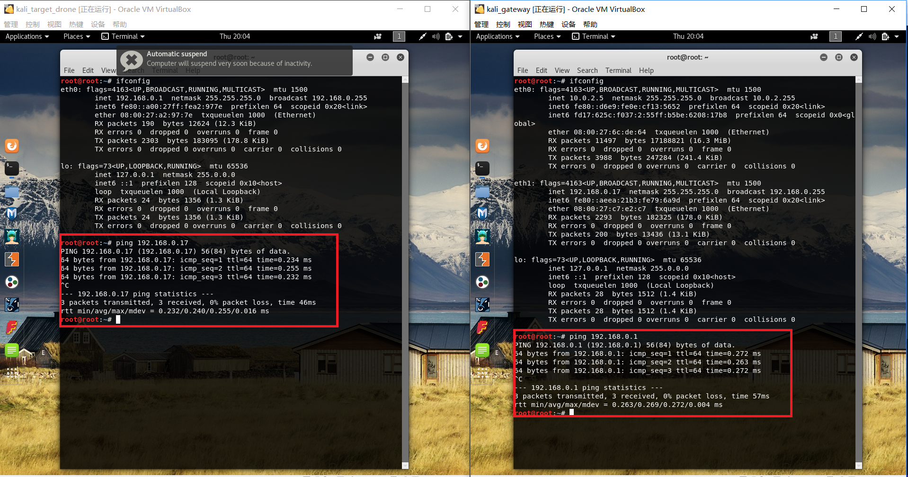

# chap0x01 基于VirtualBox的网络攻防基础环境搭建实验报告
## 实验要求
* 节点：靶机、网关、攻击者主机
    * 连通性
        * 靶机可以直接访问攻击者主机
        * 攻击者主机无法直接访问靶机
        * 网关可以直接访问攻击者主机和靶机
        * 靶机的所有对外上下行流量必须经过网关
        * 所有节点均可以访问互联网
    * 其他要求
        * 所有节点制作成基础镜像（多重加载的虚拟硬盘）

## 虚拟机环境说明
* 靶机(target) / 网关(gateway) / 攻击者(attacker)

    ```kali-linux-2018.3-amd64.iso ```

## 多重加载基础镜像步骤
* 点击 配置->虚拟介质管理->选中需要设置的vdi->点击属性->类型选择多重加载<br>

* 在弹出的提示框中选择释放</br>
  

* 新建虚拟电脑，虚拟硬盘选择"使用已有的虚拟硬盘文件"选中之前设置的vdi<br>


## 配置各节点网卡
* 靶机(target)
    * 一块internal(内部网络)配置网卡
    
    * 配置ip地址为192.168.0.1，子网掩码为255.255.255.0，默认网关为192.168.0.17
    
* 网关(gateway)
    * 一块net network配置网卡[eth0],一块internal(内部网络)配置网卡[eth1]
    * eth0 IP地址为 10.0.2.5
    
    * eth1 配置IP地址为192.168.0.17，子网掩码为255.255.255.0，默认网关为10.0.2.5
    
* 攻击者(attacker)
    * 一块net network配置网卡
    IP地址为 10.0.2.6
    
### 配置靶机internal网卡和网关的internal网卡处于同一网段，网关net network网卡和攻击者的net network网卡处于一个网段

## 连通性检测
* 靶机 <---> 网关</br>

靶机与网关之间可以ping通
* 网关 <---> 攻击者</br>

网关和攻击者之间可以ping通
* 靶机 ---> 攻击者</br>

靶机ping攻击者ping不通，监听网关的网卡，发现内网网卡(eth1)接收了来着靶机的request,但是net network(eth0)网卡并没有进行转发</br>
    * 网关开启端口转发</br>
    ```
    echo 1 >/proc/sys/net/ipv4/ip_forward
    ```
    
    设置端口转发以后，发现靶机仍无法ping通攻击者，但是外网网卡已经往外发数据包，监听攻击者网卡，发现攻击者已经往外发reply,目标机器IP是196.168.0.1,在没有配置网关iptables的情况下，网关并不会收到此reply</br>
    
    * 添加网关iptable,靶机ping通攻击者</br>
    ```
    iptables -t nat -A POSTROUTING -s 内网ip -j MASQUERADE
    iptables-save
    ```
    
* 攻击者--->靶机</br>
无法ping通</br>

* 查看网关DNS服务器，发现与真机DNS一样</br>

* 修改靶机DNS</br>
```
/etc/resolv.conf
```

* 所有节点均可以访问互联网</br>


## 实验总结
### 网络拓扑图

### 实验涉及相关知识点总结
* 网络模式的快速概述</br>

https://www.virtualbox.org/manual/ch06.html#network_nat
* iptables 相关命令
    * 列出net所有规则
    ```
    iptables -L -t nat 
    ```
    * 启动网络转发规则
    ```
    iptables -t nat -A POSTROUTING -s 内网网段 -j SNAT --to-source 网关外网ip
    ```

    * MASQUERADE 动态获取
    ```
    iptables -t nat -A POSTROUTING -s 192.168.1.0/24 -j MASQUERADE
    ```
https://wangchujiang.com/linux-command/c/iptables.html

* ipv4转发功能永久生效
在``` /etc/sysctl.conf```文件中将 ```net.ipv4.ip_forward = 1```注释去除</br>

* 添加防火墙nat规则
```
iptables -t nat -L -n
iptables-save -c > iptables.rules
vi iptables.rules
iptables-restore < iptables.rules
```


