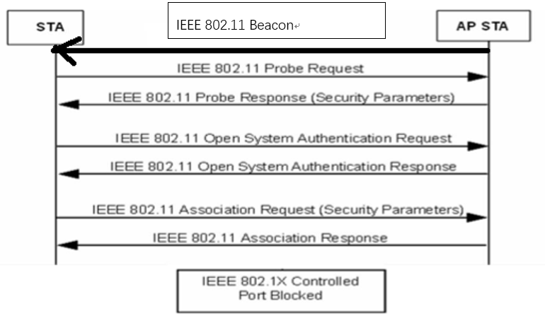
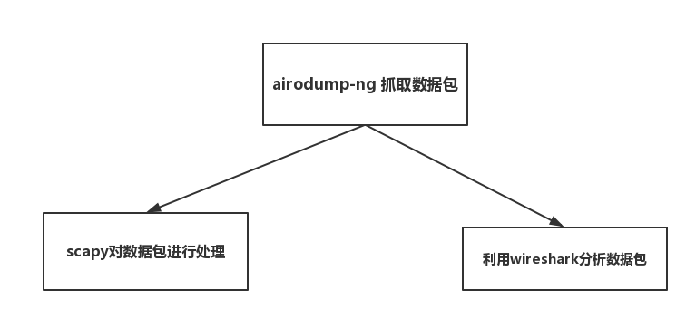
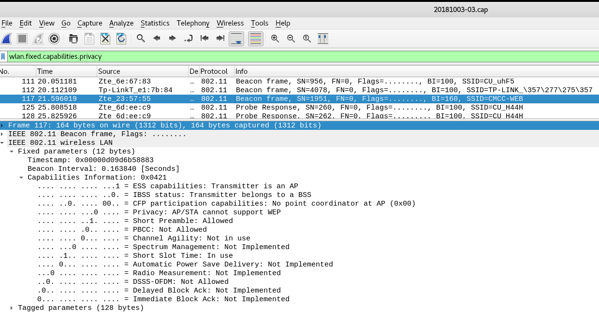
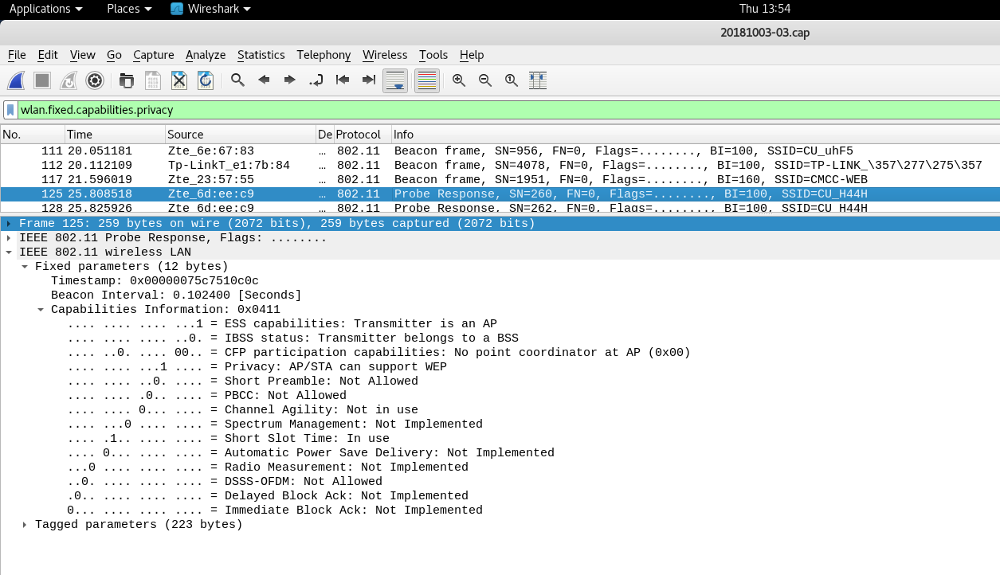
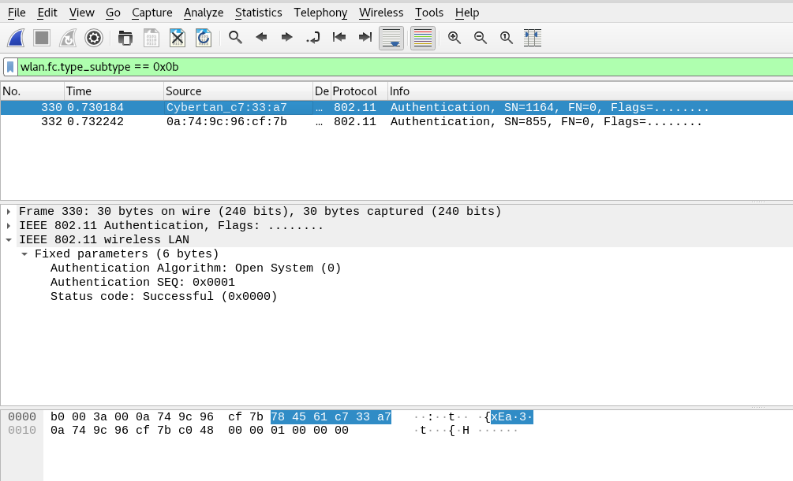
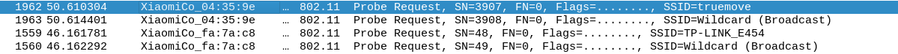

# chap0x02 实验报告
## 802.11 开放式认证过程

### 1. AP以一定频率广播发送Beacon frame
### 2. STA指定SSID的AP发送连接请求(Probe Request)
### 3. AP对STA的连接请求进行应答
### 4. STA对目标AP进行身份认证(Authentication Request)
### 5. AP对STA身份认证请求作出回应(Authentication Response)
### 6.STA向AP发送连接请求(Association Request)
### 7.AP回应连接请求(Association Response)

## 实验流程 <br>


### 数据包抓取：<br>
```
airodump-ng wlan0mon -w 20181004.cap
```
### 数据包抓取结果 <br>

### scapy对数据包处理 <br>
```py
from scapy.all import *


packets_list = rdpcap("20181003-03.cap")

ssid_list = []

for pkt in packets_list:
    if pkt.haslayer(Dot11) and pkt.type == 0 and (pkt.subtype == 8 or pkt.subtype == 5):
        if [pkt.addr2,pkt.info,pkt.len] not in ssid_list:
            ssid_list.append([pkt.addr2,pkt.info,pkt.len])

sort_list = sorted(ssid_list,key = lambda x: x[1].lower())

print "%-20s%-10s%-10s" % ('MAC addres','length','SSID')
for addr,ssid,length in sort_list:
    print "%-20s%-10d%-10s" %(addr,length,ssid)
```

```
MAC addres          length    SSID      
d6:ee:07:5c:c9:15   0                   
ea:64:c7:23:57:55   12        and-Business
22:b3:62:a4:4a:1a   8         carrie17  
80:f6:2e:dc:63:f0   8         ChinaNet  
0c:da:41:04:4a:b0   8         ChinaNet  
da:64:c7:23:57:55   4         CMCC      
c8:64:c7:23:57:55   8         CMCC-WEB  
9c:6f:52:6e:25:d7   7         CU_A2kd   
9c:6f:52:6e:20:a3   7         CU_DTxK   
30:99:35:6a:31:69   7         CU_E37p   
9c:6f:52:6e:b9:d9   7         CU_ekEX   
28:bf:89:a1:89:9e   7         CU_ERc9   
9c:6f:52:6d:ee:c9   7         CU_H44H   
9c:6f:52:6e:21:2a   7         CU_RbYp   
9c:6f:52:6d:ef:50   7         CU_t4Qd   
9c:6f:52:6e:67:83   7         CU_uhF5   
d4:ee:07:5c:c9:16   14        Danke-2501-新
14:75:90:e1:7b:84   12        TP-LINK_����
```
## Q1:查看统计当前信号覆盖范围内一共有多少独立的SSID？其中是否包括隐藏SSID？哪些无线热点是加密/非加密的？加密方式是否可知？

- ### 当前一共有18个独立的SSID
- ### 隐藏SSID包括
    - #### 不广播Beacon Frame只回复Probe Response 
    - #### SSID为空或用\x00填充
### 通过 ``` tshark -r 20181003-03.cap -Y wlan.fc.type_subtype==8 -T fields -e wlan.sa -e wlan.ssid | cat -v |sort -u ```查看Beacon Frame
```
0c:da:41:04:4a:b0	ChinaNet
14:75:90:e1:7b:84	TP-LINK_M-oM-?M-=M-oM-?M-=M-oM-?M-=M-oM-?M-=
22:b3:62:a4:4a:1a	carrie17
28:bf:89:a1:89:9e	CU_ERc9
30:99:35:6a:31:69	CU_E37p
80:f6:2e:dc:63:f0	ChinaNet
9c:6f:52:6d:ee:c9	CU_H44H
9c:6f:52:6d:ef:50	CU_t4Qd
9c:6f:52:6e:20:a3	CU_DTxK
9c:6f:52:6e:21:2a	CU_RbYp
9c:6f:52:6e:25:d7	CU_A2kd
9c:6f:52:6e:67:83	CU_uhF5
9c:6f:52:6e:b9:d9	CU_ekEX
c8:64:c7:23:57:55	CMCC-WEB
d4:ee:07:5c:c9:16	Danke-2501-M-oM-?M-=M-oM-?M-=M-oM-?M-=
d6:ee:07:5c:c9:15	
da:64:c7:23:57:55	CMCC
ea:64:c7:23:57:55	and-Business

```
### 通过 ``` tshark -r 20181003-03.cap -Y wlan.fc.type_subtype==5 -T fields -e wlan.sa -e wlan.ssid | cat -v |sort -u ```查看Beacon Frame
```
14:75:90:e1:7b:84	TP-LINK_M-oM-?M-=M-oM-?M-=M-oM-?M-=M-oM-?M-=
30:99:35:6a:31:69	CU_E37p
80:f6:2e:dc:63:f0	ChinaNet
9c:6f:52:6d:ee:c9	CU_H44H
9c:6f:52:6e:20:a3	CU_DTxK
9c:6f:52:6e:21:2a	CU_RbYp
9c:6f:52:6e:25:d7	CU_A2kd
9c:6f:52:6e:b9:d9	CU_ekEX
c8:64:c7:23:57:55	CMCC-WEB
da:64:c7:23:57:55	CMCC
```
- 隐藏的SSID一共有1个
- 判断无线热点是否加密及其加密方式
    - ```wlan.fixed.capabilities.privacy```
    值为1为加密，为0为未加密
    ```
    tshark -r 20181003-03.cap -Y wlan.fixed.capabilities.privacy -T fields -e wlan.sa -e wlan.fixed.capabilities.privacy | sort -u


    0c:da:41:04:4a:b0	0
    14:75:90:e1:7b:84	0
    22:b3:62:a4:4a:1a	1
    28:bf:89:a1:89:9e	1
    30:99:35:6a:31:69	1
    80:f6:2e:dc:63:f0	0
    9c:6f:52:6d:ee:c9	1
    9c:6f:52:6d:ef:50	1
    9c:6f:52:6e:20:a3	1
    9c:6f:52:6e:21:2a	1
    9c:6f:52:6e:25:d7	1
    9c:6f:52:6e:67:83	1
    9c:6f:52:6e:b9:d9	1
    c8:64:c7:23:57:55	0
    d4:ee:07:5c:c9:16	1
    d6:ee:07:5c:c9:15	1
    da:64:c7:23:57:55	1
    ea:64:c7:23:57:55	0


    ```
    
    

    - 因20181003-03.cap未能捕获到有```wlan.fixed.auth.alg```字段的帧,所以进行了重新抓包<br>
    


## Q2：如何分析出一个指定手机在抓包时间窗口内在手机端的无线网络列表可以看到哪些SSID？这台手机尝试连接了哪些SSID？最终加入了哪些SSID？

- 手机端的无线网络列表 手机端通过侦听AP定期发送的Beacon Frame来发现SSID
- 通过查看手机发送的Probe Request帧查看手机尝试连接哪些SSID

- 通过Association Response帧判断最终加入SSID

## Q3：SSID包含在哪些类型的802.11帧？
本次实验得：
- Beacon frame
- Probe response
- Probe request
- Association

## 参考资料
- [2018-NS-Public-jckling](https://github.com/CUCCS/2018-NS-Public-jckling/blob/56c7a202aa9c3ab8a38ce402026f6be7a9433ae1/mis-0x02/第二章实验练习题.md)<br>
- [2018-NS-Public-TheMasterOfMagic](https://github.com/CUCCS/2018-NS-Public-TheMasterOfMagic/blob/6a0375bef1853cab614c466d0952e36918904b62/mis/mis-chap0x02.md)<br>
- [移动互联网安全 第二章实验](https://sec.cuc.edu.cn/huangwei/textbook/mis/chap0x02/exp.html)
- [scapy官方文档](https://scapy.readthedocs.io/en/latest/)


    


