# 编程实现网络扫描实验
## 实验环境
- kali-linux-2018.3-amd64.iso
## 实验工具
- nmap 
- scapy
- iptables

## 网络拓扑图
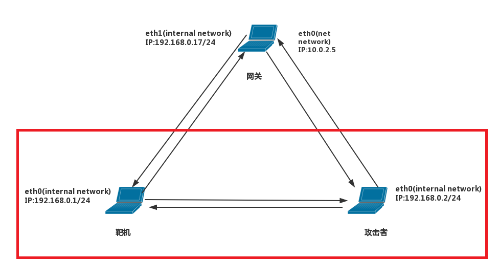

## 实验步骤
### TCP Connect scan
#### 实验原理：使用TCP三次握手机制，建立一个链接到目标主机特定端口。首先发送SYN包，如果接收到SYN/ACK数据包，则说明目标主机端口处于开放状态；若收到RST/ACK包，说明目标主机端口处于关闭状态；若目标主机没有响应，目标主机端口处于过滤状态
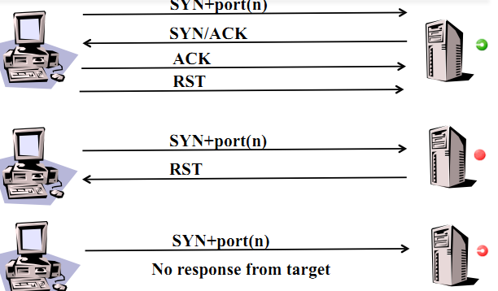

#### 实验代码
```py
import logging
logging.getLogger("scapy.runtime").setLevel(logging.ERROR)

from scapy.all import *


dst_ip = "192.168.0.1"
src_port = RandShort()
dst_port = 80

#make TCP packet
#SYN
pkt_s = IP(dst = dst_ip) / TCP(sport = src_port,dport = dst_port,seq = 0,flags = "S")

tcp_connect_scan_resp = sr1(pkt_s,timeout = 10)
if(str(type(tcp_connect_scan_resp)) == "<type 'NoneType'>"):
	print "filtered"
elif(tcp_connect_scan_resp.haslayer(TCP)):
	if(tcp_connect_scan_resp.getlayer(TCP).flags == 0x14):
		print "Closed"
	elif(tcp_connect_scan_resp.getlayer(TCP).flags == 0x12):
		print "Open"
		#ACK and RST
		my_ack = tcp_connect_scan_resp.getlayer(TCP).seq + 1;
		pkt_AR = IP(dst = dst_ip) / TCP(sport = src_port,dport = dst_port,seq = 1,ack = my_ack,flags = "AR")
		tcp_connect_scan_resp_1 = sr1(pkt_AR,timeout = 10)

```
- ### 查看端口原始状态<br>
```
nmap 192.168.0.1
```
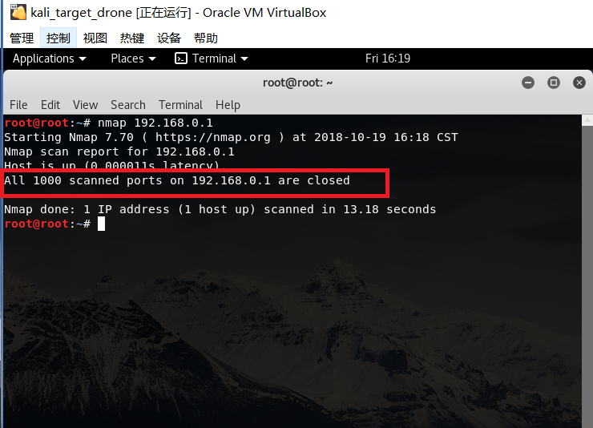

- ### 在attacker端运行对应python代码，在target端用```sniff```嗅探
```
sniff(filter = "tcp and (port 80)",prn = lambda x: x.sprintf("%IP.src%:%TCP.sport%->%IP.dst%:%-10s,TCP.dport% seq:%-10s,TCP.seq% ack:%-10s,TCP.ack% %-2s,TCP.flags%: %TCP.payload%"))
```
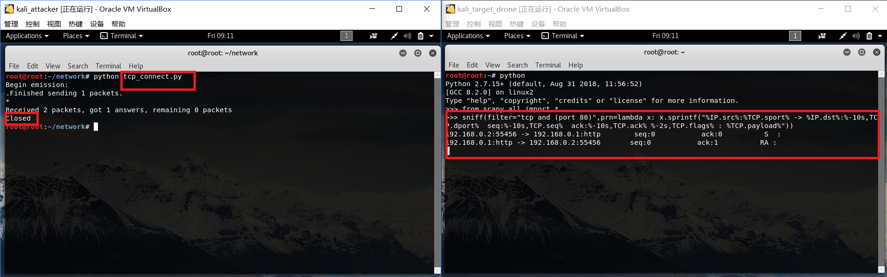
- 开启tcp 80端口，再进行如上操作
```
nc -l -p 80
```
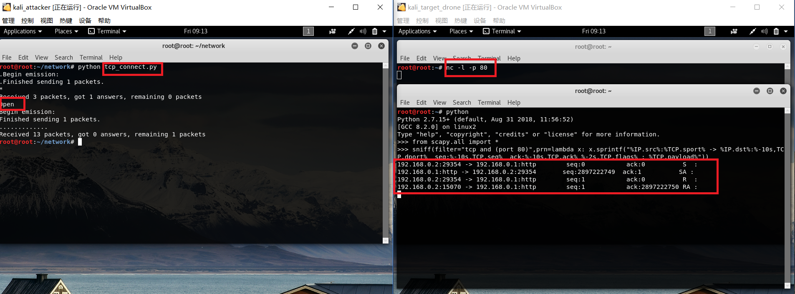
此处第三个RST数据包会被源端口发送是因为源端口处于关闭状态<br>

- 过滤端口网络扫描实验将在后面统一进行描述

### TCP Stealth scan
#### 实验原理：TCP Stealth scan 不需要打开完整链接，发送一个SYN包启动三次握手链接机制，如果接收到SYN/ACK包表示目标主机端口开放，当接收SYN/ACK包时，发送端回立刻发送一个RST包拆除链接；如果接收到一个RST/ACK包表示目标主机端口关闭；没有接收到数据包表示目标端口处于过滤状态

#### 实验代码
```py
import logging
logging.getLogger("scapy.runtime").setLevel(logging.ERROR)
from scapy.all import *

dst_ip = "192.168.0.1"
src_port = RandShort()
dst_port = 80

pkt_s = IP(dst = dst_ip)/TCP(sport = src_port,dport = dst_port,flags = "S")
pkt_r = IP(dst = dst_ip)/TCP(sport = src_port,dport = dst_port,flags = "R")

stealth_scan_resp = sr1(pkt_s,timeout = 10)

if(str(type(stealth_scan_resp)) == "<type 'NoneType'>"):
	print "filtered"
elif(stealth_scan_resp.haslayer(TCP)):
	if(stealth_scan_resp.getlayer(TCP).flags == 0x14):
		print "Closed"
	elif(stealth_scan_resp.getlayer(TCP).flags == 0x12):
		print "Open"
		#RST
		stealth_scan_resp_1 = sr1(pkt_r,timeout = 10)
```
实验主要步骤与上述TCP Connect scan相同，只是sniff嗅探变为运行如下代码:<br>
```py
import sys
from scapy.all import *

a = sniff(filter = "tcp or udp or icmp and (port 80")
wrpcap("20181019.cap",a)

```
#### 结果
- 未开放80端口
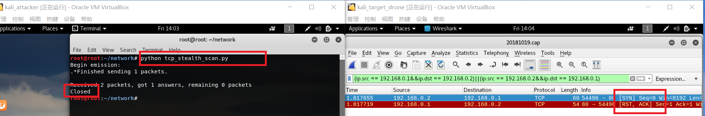
- 开放80端口
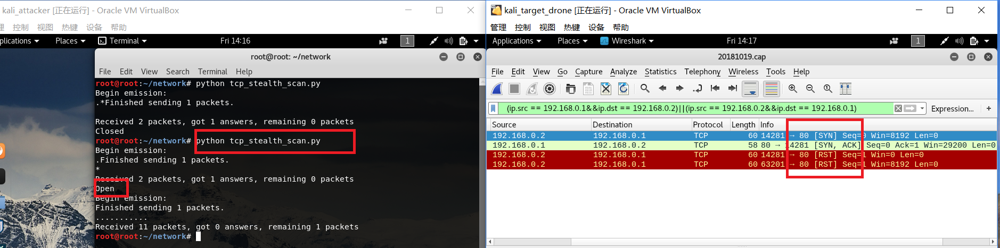
### TCP Xmas scan
#### 实验原理：Xmas扫描发送一个TCP包，并对TCP报文头FIN、URG、PUSH标记进行设置。若是关闭的端口则响应 RST 报文；开放或过滤状态下的端口则无任何响应。


#### 实验代码
```py
import logging
logging.getLogger("scapy.runtime").setLevel(logging.ERROR)
from scapy.all import *

dst_ip = "192.168.0.1"
src_port = RandShort()
dst_port = 80

pkt_fpu = IP(dst = dst_ip)/TCP(sport = src_port,dport = dst_port,flags = "FPU")

xmas_scan_resp = sr1(pkt_fpu,timeout = 10)

if(str(type(xmas_scan_resp)) == "<type 'NoneType'>"):
	print "Open|Filter"
elif(xmas_scan_resp.haslayer(TCP)):
	if(xmas_scan_resp.getlayer(TCP).flags == 0x14):
		print "Closed"
```
#### 实验过程
与上述 TCP Stealth scan相同
#### 实验结果
- 未开放80端口
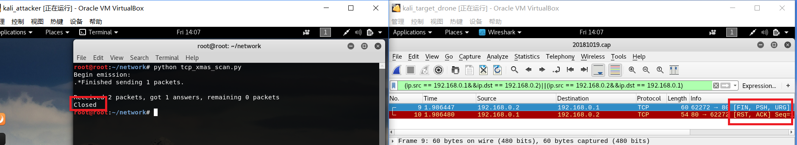
- 开放80端口
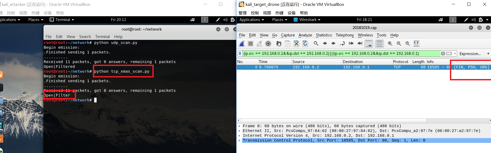

### UDP scan
#### 实验原理：向一个未开放的 UDP 端口发送数据时,其主机就会返回一个 ICMP 不可到达(ICMP_PORT_UNREACHABLE)的错误。UDP scan 向被扫描UDP 端口发送零字节UDP数据包，如果收到一个ICMP不可达响应，认为目标主机端口关闭，没有响应的主机端口认为处于开放或过滤状态

#### 实验代码
```py
import logging

logging.getLogger("scapy.runtime").setLevel(logging.ERROR)
from scapy.all import * 
dst_ip = "192.168.0.1"
src_port = RandShort()
dst_port = 69

pkt_udp = IP(dst = dst_ip)/UDP(sport = src_port,dport = dst_port)
udp_scan_resp = sr1(pkt_udp,timeout = 10)

if (str(type(udp_scan_resp)) == "<type 'NoneType'>"):
    print("Open|Filtered")
elif (udp_scan_resp.haslayer(UDP)):
    print("Open")
elif (udp_scan_resp.haslayer(ICMP)):
    if (int(udp_scan_resp.getlayer(ICMP).type) == 3 and int(udp_scan_resp.getlayer(ICMP).code) == 3):
        print("Closed")
```
#### 实验过程
- 未开放53端口(53端口为```DNS```端口)
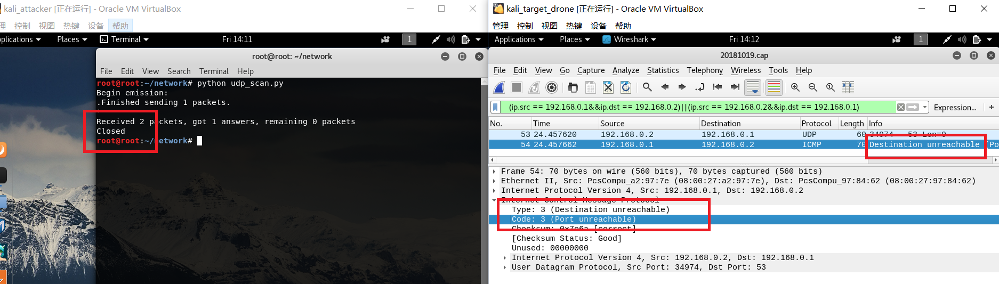
- 开放53端口
用```nc -u -l -p 53```并不能得到期望的结果，而使用```nc -u -l -p 53 < /root/workspace/test```
得到结果：
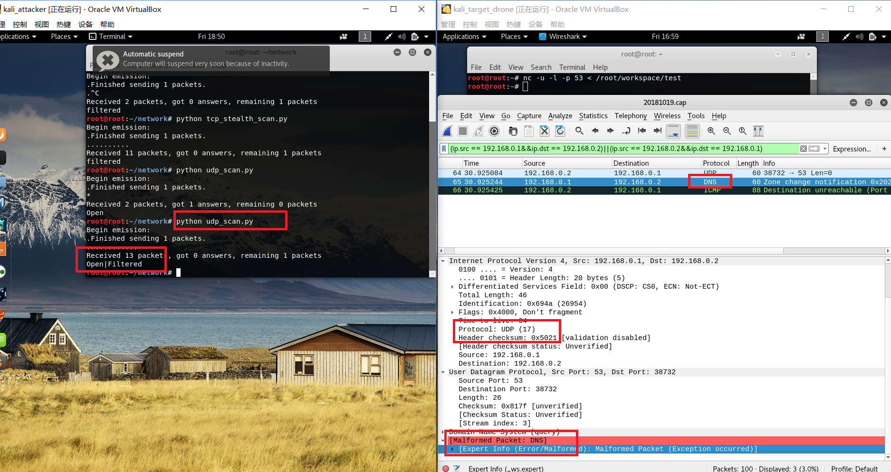
1.推测只有需要发送数据的情况下，才会把UDP端口打开
2.虽然53端口有非不可达ICMP的响应，但实验得到结果是端口```open|Filtered```
通过观察DNS包内部，并参考[此处](https://github.com/CUCCS/2018-NS-Public-xaZKX/blob/9292eb10d9ce1bda18d282d136943ae5c466ef1a/ns-chap05/chap0x05%20%E7%BC%96%E7%A8%8B%E5%AE%9E%E9%AA%8C%E6%8A%A5%E5%91%8A.md)将代码中```elif (udp_scan_resp.haslayer(UDP))```修改为```elif (udp_scan_resp.haslayer(UDP) or udp_scan_resp.getlayer(IP).proto == IP_PROTOS.udp)```
- 开放69端口（69端口为 ```小型文件传输协议```端口）
得到嗅探数据包如下：<br>
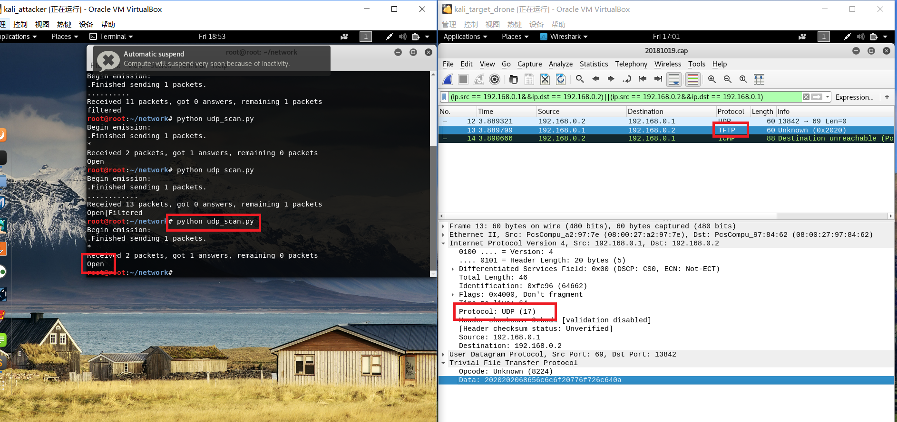
其中Data的数据为<br>
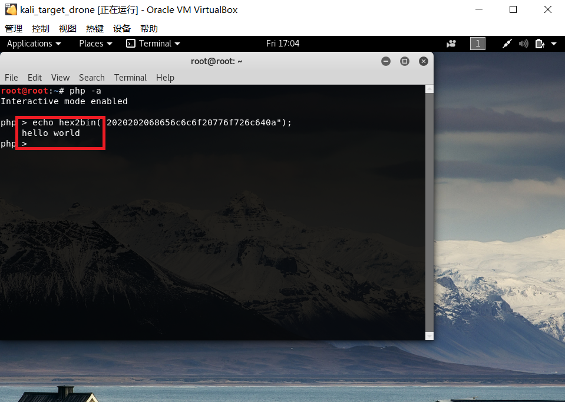
和```/root/workspace/test```中内容相同
### 过滤端口的网络扫描
#### 实验步骤
- 添加防火墙规则，设置端口为过滤状态
```
iptables -A INPUT -p tcp --dport 80 -j DROP
iptables -A INPUT -p udp --dport 69 -j DROP
```
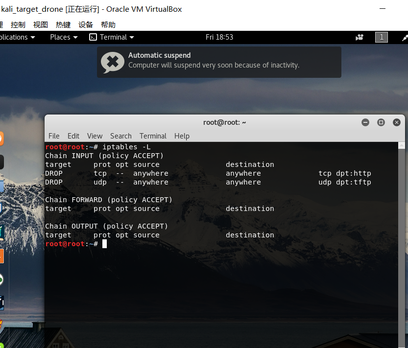
- 运行各端口扫描方法对应代码
#### 实验结果
- TCP Connect scan
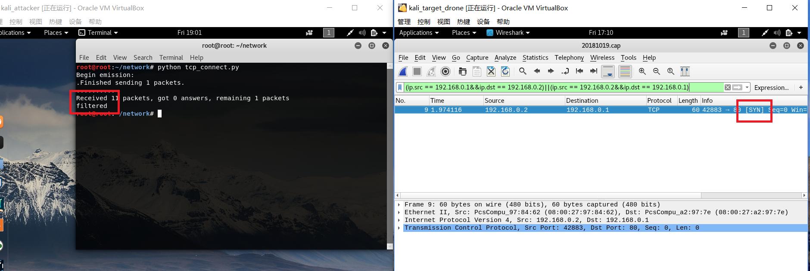
- TCP Stealth scan
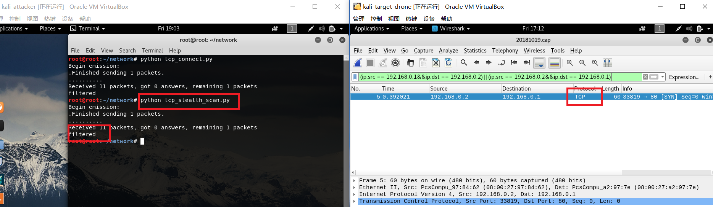
- TCP Xmas scan
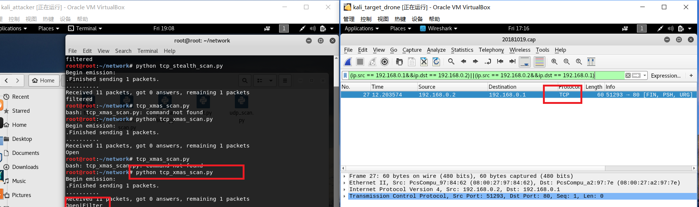

## 参考资料
- [scapy 官方文档](https://scapy.readthedocs.io/en/latest/usage.html#starting-scapy)<br>
- [第五章-网络扫描](https://sec.cuc.edu.cn/huangwei/textbook/ns/chap0x05/main.html)<br>
- [Port Scanning using Scapy](https://resources.infosecinstitute.com/port-scanning-using-scapy/#gref)<br>
- [TCP/UDP端口列表](https://zh.wikipedia.org/wiki/TCP/UDP%E7%AB%AF%E5%8F%A3%E5%88%97%E8%A1%A8)<br>
- [NetCat使用指南](https://www.jianshu.com/p/cb26a0f6c622)
- [Tips to understand different TCP port-scanning techniques](https://searchnetworking.techtarget.com/tip/Tips-to-understand-different-TCP-port-scanning-techniques)

